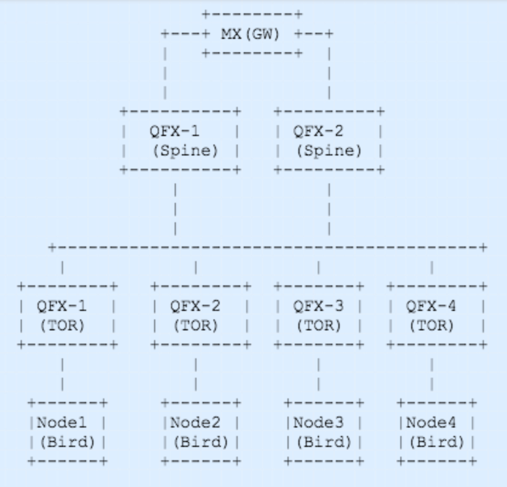

# bird-bgp-ospf

Bird internet routing daemon distributed under GNU General Public License is a fully functional routing engine that is deployed on linux 
and FreeBSD systems. For more details please go to http://bird.network.cz/

This project is to have valid tested configuration for Anycast VIP advertisments for opencontrail using either OSPF or BGP. 

It will have configuration of bird for OSPF and BGP and also include OSPF and BGP configurations for Junos QFX top of rack switch. 

# Ansible for bird configuration

Ansible is used for installing and configuring the servers with bird. Currently it supports debian systems. Support for redhat / centos will be added later.

Steps for running playbook:

1-> Update the inventory file with the servers that need to have bird installed
    
    Ex: 
        [birds]
        10.10.10.10
        20.20.20.20

2-> Update the bird_network_proto, vip and networks in group_vars/birds. The networks are the networks that you want the static route to be configured by bird on the servers and update the routing tables. 

3-> Run the setup.sh script

    Ex:
       `INVENTORY=/home/users/bird-admin/bird-hosts /home/users/bird-admin/setup.sh`
        or
        > pwd
        /home/users/bird-admin
        > export INVENTORY=/home/users/bird-admin/bird-hosts
        > ./setup.sh

The result of the above steps will be servers configured with bird OSPF.

# Sample configs 

Same config files for OSPF and BGP can be found here https://github.com/sanabby/bird-bgp-ospf/tree/master/sample-bird-configs

# Topology

  

In the above diagram, there is GW router for the cluster/site/DC. The IP CLOS fabric with spine and leaf (TOR) has uplink to the GW. Nodes/servers on which the bird is deployed is connected to the TOR that has l3 interfaces enabled and can talk BGP or OSPF. 

In the lab deployed used here it depicts all Juniper devices, MX for GW router, QFX-3500 for TOR and QFX-3600 for spine.

For the detailed configuration from one the TOR please look at the Network-config section below.

In this topology bird-bgp stack is running on 4 nodes that provides anycast VIP. In production deployments, it can be deployed on the ideal number of servers / controllers that consitue a cluster. 

* In general, recommendation for contrail HA consists of 3 controllers.

# Network Config

Juniper QFX 3500 TOR config for OSPF and BGP peering with the bird can be found @ https://github.com/sanabby/bird-bgp-ospf/tree/master/network-configs/qfx-3500-tor.config

For OSPF config please look at the OSPF area 0.0.0.1 and for BGP look at the section __bird__ in file https://github.com/sanabby/bird-bgp-ospf/tree/master/network-configs/qfx-3500-tor.config
